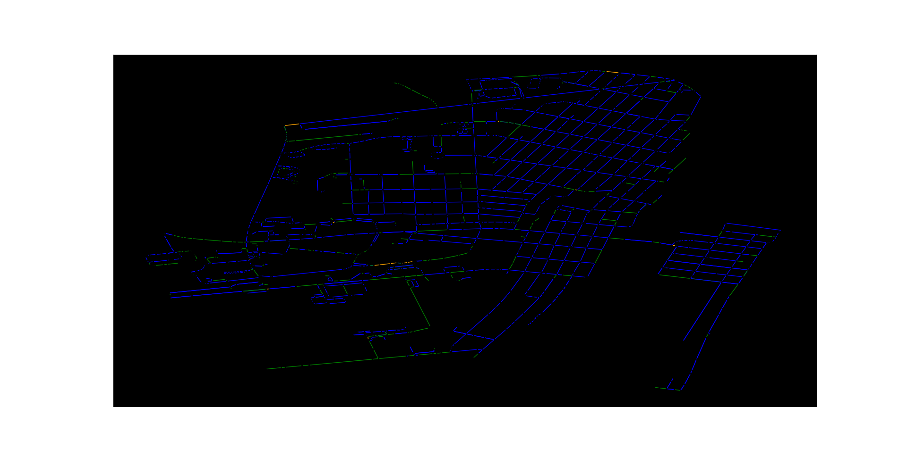

# Every Street

This repository is a part of a project to ride a bicycle on every street of Selinsgrove, PA, my home town. Selinsgrove is a small town, with only 6,000 people and less than 5 square kilometers of land. I believe it is possible to cover every street within the span of 1 day (and hopefully a lot less than that). In order to meet this time requirement though, we will want to compute the _provably_ shortest path we can take which will cover the length of each street once. In computer science, this problem is known as the [route inspection problem](https://en.wikipedia.org/wiki/Chinese_postman_problem).

If we model every street and intersection as edges and nodes within a graph, then we can run this algorithm and it will generate a route which is the shortest possible path that covers each street at least once. In order to do this, we will need to collect data on the town in question.

## General process
1. Download the map you are interested in from [Open Street Maps](https://www.openstreetmap.org/#map=15/40.7995/-76.8631) (consider donating too if you like the service they provide! If you don't have the cash, you can always contribute to their data). This is possible by clicking "export" and then selecting a rectangle of the area you want to export
2. Move this into the /data/ directory. In the interactive CLI of this program you can provide a file path. With just these two steps, we would get something like this:

3. Some of these lines actually go out of the city we want here (Selinsgrove, PA). Unfortunately, Open Street Maps only allows us to grab a rectangle. Most cities are not a rectangle though. You will have to create a file in ./data/[FILE_NAME].txt. This text file will contain a list of coordinates formatted in a very particular manner. There is an example in that directory. You can collect these coordinates from Google Maps by just clicking around and reading what is there. **Warning**: be very certain that the first coordinate and the last coordinate are the same. This will create a polygon. The code will remove any nodes / edges not in our polygon. Again, part of the CLI will ask you for a filepath to this .txt fileHere is the "clean" data. I also made it dark mode!

4. Next we need to modify the graph so that it is something called an "Eulerian circuit." I'm going to skip over the theory here, though you can learn more [here](https://en.wikipedia.org/wiki/Eulerian_path). We might be curious how much overlap there will be in our route. What streets will we have to repeat twice? This "heatmap" will tell us where. Roads that are blue need to be traversed once, green twice, orange three times, and red four times:

5. That looks pretty good! Actually, this algorithm is efficient enough that the total length of all roads in Selinsgrove is about 65.4 km. This is the absolute minimum, and only possible if the roads are laid out in... a very convenient way. After making the graph Eulerian, it's only 90.3 km! That's only a 38% increase in the amount of road we need to cover!
6. Finally, we generate the route. We can generate an animation showing this route as well:
https://user-images.githubusercontent.com/59176275/221004213-891938ce-6760-4104-a30f-5975e94d1dc8.mp4
